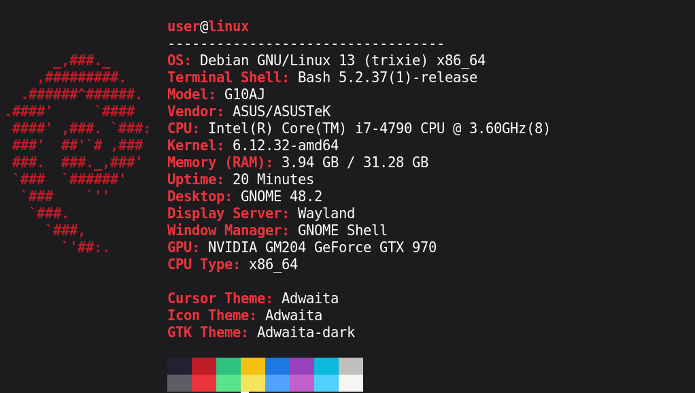

# PyFetch
Like neofetch, but in python (WIP) For Linux (Tested on Debian 12)

TODO:

Whatever comes to mind

Depends:
`Python 3.6` or newer with `psutil`, `os`, & `sys`

`lspci` also needs to be installed

`wmctrl` needs to be installed if you want the window manager to show up in the output

# How To Install As a Local Application

# Method 1

*  Rename `main.py` to `pyfetch` (No extension)

*  Move the file into `~/.local/bin/`

# Method 2
* Run `install.sh`

Now that you have "installed" it, type in your console `pyfetch` and you should get the output of the script
